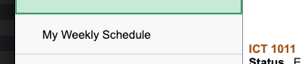
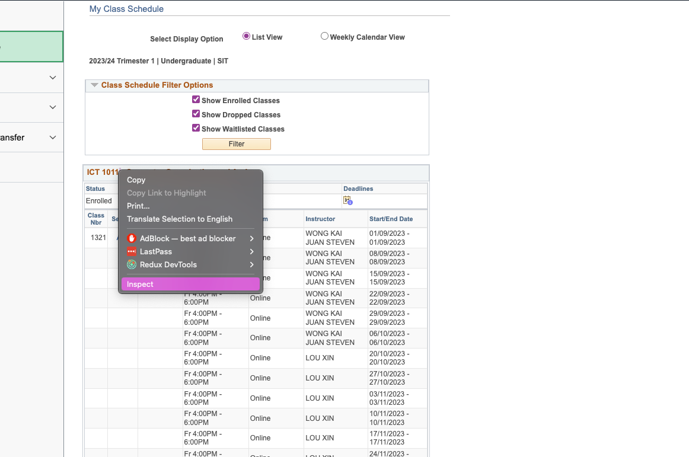
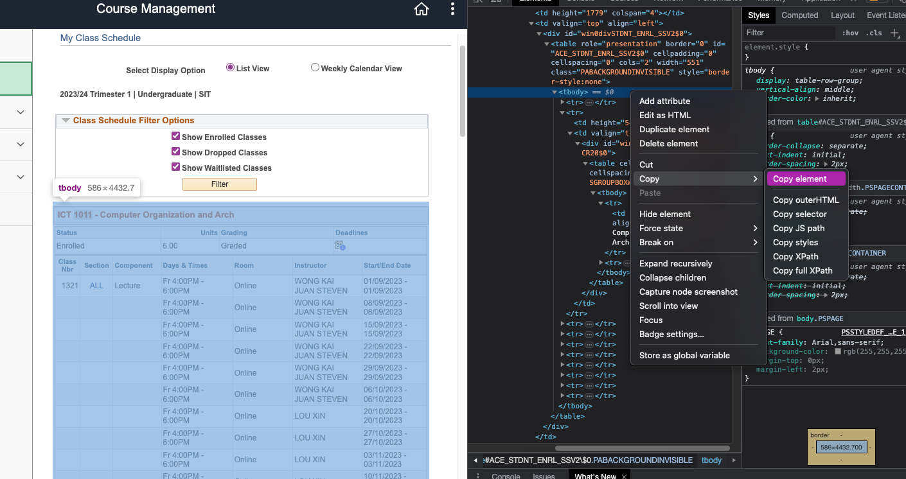

# SIT_TImetable_Extractor

## Setup

Ensure that you are using Python3.

### Installing Modules

Open Command Prompt (or Terminal if Linux), `cd` to the directory which this project is at.

```
pip install -r requirement.txt
```

<br>

## Step-by-Step Guide

Step 1:

<br>

Step 2:

<br>

Step 3:

<br>

Step 4:

<br>

Step 5:

<br>

## Step 6: Paste Element Code into "Original.html" in Timtable_Extracter Folder

## Step 2: Execute `main.py` Script

## Step 3: Chose Method 1 or Method 2 on GUI

Method 1

All your module will be generate into sepcfic button now u click on which module u want to generate the HTML
After click on the module u want , then u can click 'Generate JSON' button then the 'Generate .CSV for Google Calender' button

Method 2

Just click the button in the sequenece u see on the gui under method 2 and then move onto step 4

## Step 4: OPEN ME Folder Created all your csv is inside there

# PENDING FEATUERS

- iOS calendar
- text field for user to paste HTML

# Contact Me

Telegram : @xpluse3k
<br>
Email : jagatees.mac@gmail.com
